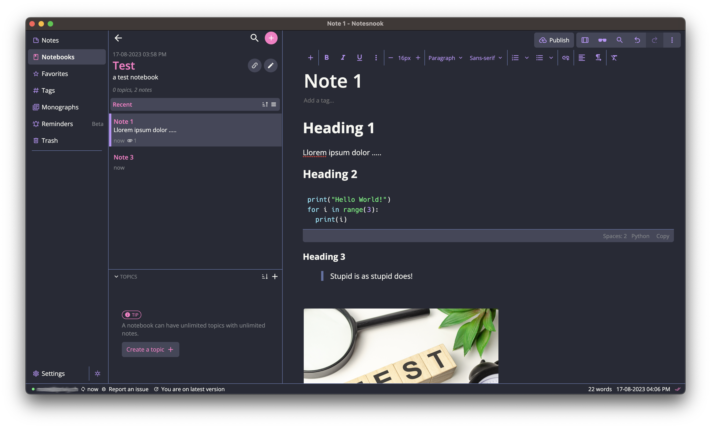

# Dracula for [Notesnook](https://notesnook.com)

> A dark theme for [Notesnook](https://notesnook.com).

#### Activating theme

1. In the Notesnook App, go to settings -> Appearance
2. Activate Dracula under dark themes.

